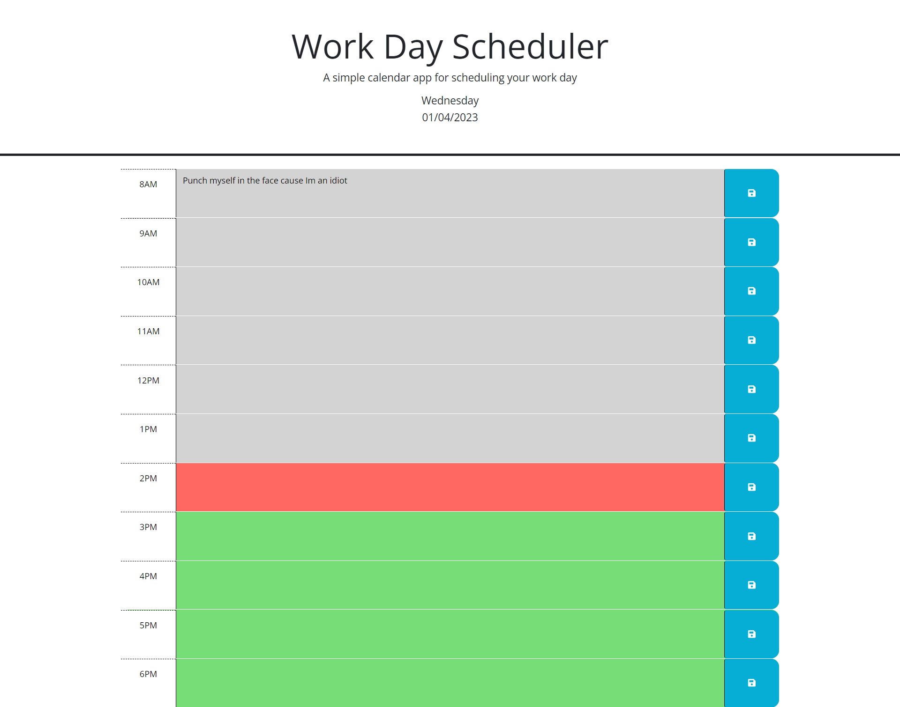

# Jd_Uncbc_Calendar

## Description

Provide a short description explaining the what, why, and how of your project. Use the following questions as a guide:

- What was your motivation? Create a calendar application utilizing local storage and jquery
- Why did you build this project? Calendars are always useful tools and deceptively complicated applications but it is 
  easily something I could incorporate into many application in the future.
- What problem does it solve? I am learning how to traverse and manipulate the DOM and also utilize local storage

## Installation

Navigate to the website

## Usage

-Select any input box next to a time and input relevant information and hit save. That information should be persistent.
    

## Credits

UNC Bootcamp starter code

## License

MIT

